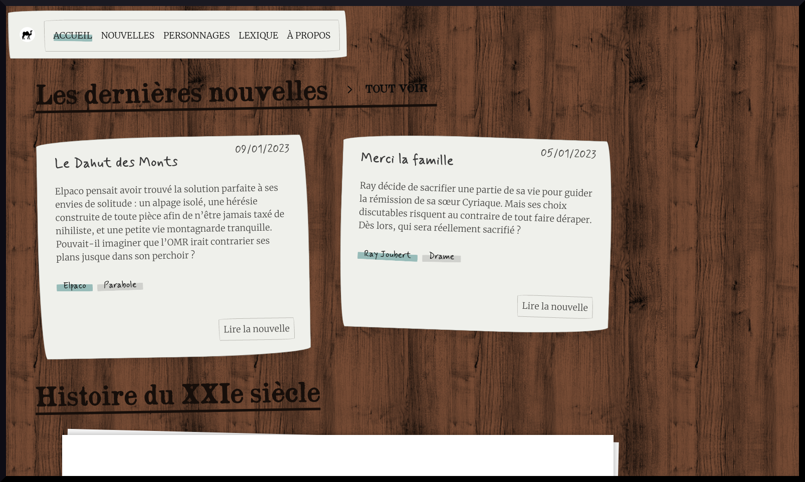

# Nouvelles exnihil

This is the source code of the website [nouvelles.exnihil.fr](https://nouvelles.exnihil.fr/).

The site presents texts and novellas written by Florent Naud about a fictional futuristic universe.



## Technical stack
* postgresql
* Python django
* Bulma CSS
* node-sass


### Prerequites 
* postgresql with a db `nouvelles_exnihil`
* pipenv
* python 3.6
* psycopg2-binary 2.8.6
* node v16.17.0

### Installation

Run:
```
$ pipenv shell
$ pipenv install
```

Generate a value for DJANGO_SECRET_KEY:

```
$ python -c 'from django.core.management.utils import get_random_secret_key; print(get_random_secret_key())'
```

and export the output as DJANGO_SECRET_KEY environment variable.

Then run:
```
$ python manage.py migrate
$ python manage.py runserver
```

### Development

- Set a .env file with `DEBUG=True` and run 
 ```
$ export $(cat .env | xargs)
```

- Generate css from scss 
```
$ cd style
$ yarn install
$ yarn start
```

- Launch django
```
$ python manage.py migrate
$ python manage.py runserver
```

- Regenerate static folder
```
$ python manage.py collectstatic --noinput --clear
```

